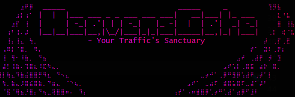
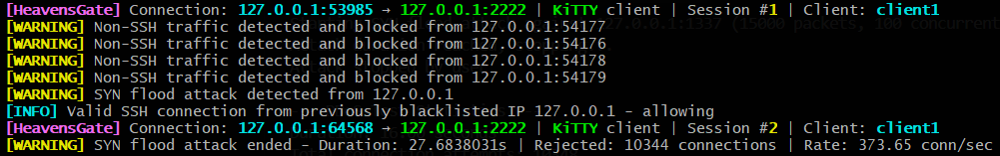

# HeavensGate TCP Proxy

HeavensGate is a defensive TCP proxy, a project being worked on for fun. It's designed to protect backend servers by providing secure connection handling, protocol validation, and DDoS protection. It's specifically optimized for SSH connections.



- Note: It is not finished or final

## Core

- **Easy Configuration**: Simple YAML configuration
- **Multi Client Support**: Handle multiple clients with different backend servers
- **SSH Protocol Support**: Optimized for SSH connections with special handling for PuTTY, KiTTY, and OpenSSH clients
- **DDoS Protection**: Advanced detection and mitigation for various attack types:
  - Application layer detection of network patterns and adaptive mitigation while preserving legit SSH connections
  - Adaptive rate limiting and blacklisting frequently attacking IPs
  - Socket flood protection
  - Malicious packet filtering
  - More to come...
- **Protocol Validation**: Custom protocol validation to ensure only valid SSH traffic reaches backend servers
- **Connection Pooling**: Efficient connection management for performance and resource efficiency
- **Detailed Logging**: Adaptive attack detection based on traffic patterns and known vector signatures

## The Guardian Angel

A custom security engine package intergrated into the proxy for advanced security features:

- **Real-time Traffic Analysis**: Deep packet inspection and behavioral monitoring to detect malicious patterns
- **Attack Signature Detection**: Inncluded signatures for common attack vectors with support for custom rules
- **Adaptive Protection**: Dynamic rate limiting and automatic blacklisting based on traffic patterns
- **Security Logging**: Detailed attack logs displaying ongoing attacks and vector signature
- **Configurable Security**: Flexible for your network


## How does it work?

HeavensGate acts as a middle man between clients and your backend applications:

```
[Clients] <---> [Guardian Angel] <---> [HeavensGate Proxy] <---> [Backend Servers]
```

The proxy uses the security engine to inspect incoming connections ,validate protocols, apply security checks, and only forward legitimate traffic to your backend servers.

## Release
- Soon... maybe
